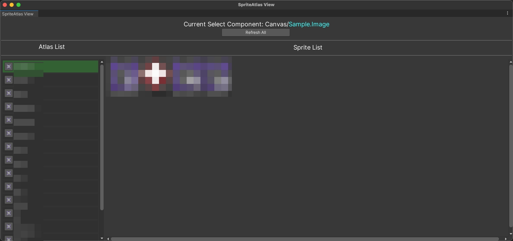

# SpriteAtlasView - Document

This tool helps you quickly look up sprite atlases in your project and the sprites within them.

**How to use it:**

1. You'll find an **"Open Sprite View Window"** button in the Inspector panel of an **Image Component** or **SpriteRenderer Component**. Click it to open the **SpriteAtlasViewWindow**.
2. Alternatively, you can open the window from the menu bar: **Tools/Venus/SpriteAtlas View**.

**Features:**

- When you select an **Image Component** or **SpriteRenderer Component**, the window will show:
  - The atlas containing the component's sprite (if the sprite isn't in an atlas, nothing will appear here).
  - A list of all sprites in that atlas (the currently selected sprite is highlighted with a green border).
- Right-click any sprite and select **"Open Sprite Editor"** to open the **SpriteEditorWindow**.
- If no component is selected, the window will display: **"No Component Selected! (Image, SpriteRenderer)"** and show a list of all atlases in the project.

**"If this tool doesn’t meet your expectations, feel free to modify it. Have a great day!"**
